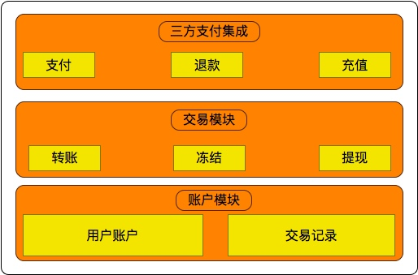
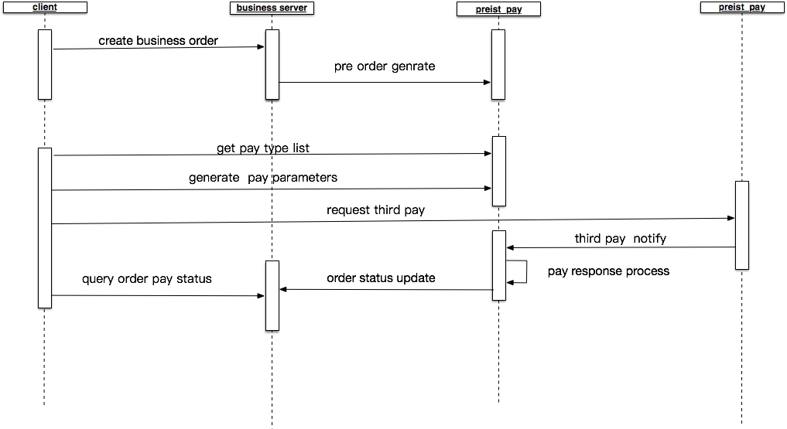
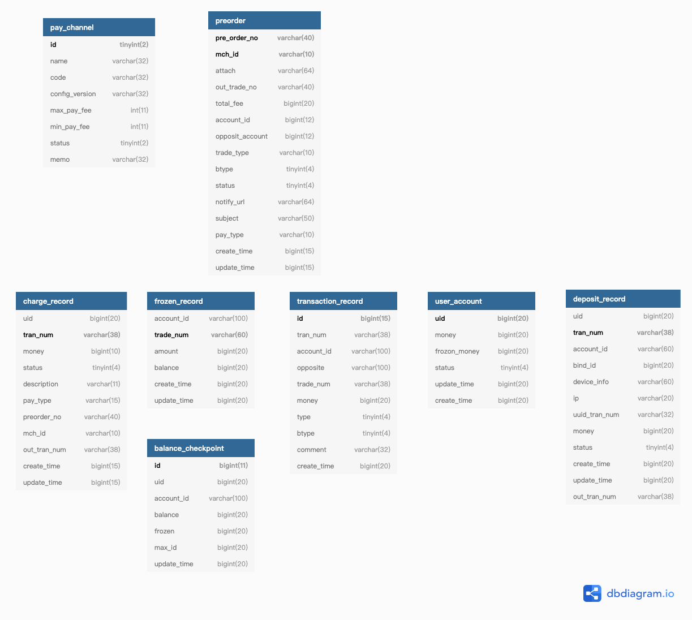

# 支付核心系统设计

## 修订记录
----
日期 | 作者 | 修订类型 | 修订内容 | 版本
---- | ---- | ---- | ---- | ---- |
2019年7月24日|little.g|A|新增设计方案|1.0
> 【修订类型：A-新增  M-修改 D-删除】

## 背景

将软件开发中三方支付系统、自有账户系统的模块独立开源，
1. 降低软件开发中支付系统的开发门槛。
2. 标准化三方业务系统接入支付逻辑接入流程。
3. 复用交易系统

## 模块划分




1. 三方支付模块 负责衔接第三方支付充值、扣款与交易模块的接口交互。
2. 交易模块 负责对业务系统提供转账、充值、冻结等接口调用
3. 账户模块 用户账户和交易记录维护

## 核心流程设计




1. 客户端请求业务系统创建业务订单
2. 业务系统请求支付系统创建预生成订单
3. 客户端获取支付方式列表，选择支付方式
4. 根据支付方式生成支付参数
5. 客户端三方sdk请求支付
6. 三方支付回调支付系统
7. 支付系统处理订单支付状态
8. 支付系统通知业务系统订单支付
9. 客户端查询支付订单

## 注意事项

交易中扣款顺序保持一致，防止交易死锁的发生

## 数据结构设计




## 接口设计


### dubbo 接口设计

#### 账户接口

```java

	/**
     * 创建账户
     * @param uid 用户ID
     */
    void createUserAccount(long uid);

    /**
     * 获取账户信息
     * @param account
     * @return
     */
    UserAccountDTO get(Account account);

    /**
     *  统计一段时间账户交易总额
     * @param account
     * @param timeStart
     * @param timeEnd
     * @return
     */
    long getBalance(Account account, long timeStart, long timeEnd);

    /**
     * 拉取账户交易记录
     * @param account
     * @param startTime
     * @param endTime
     * @param limit
     * @return
     */
    List<TransactionRecordDTO> findTransactions(Account account, Long startTime, Long endTime, Integer limit);

    /**
     * 转账
     * @param fromUid
     * @param toUid
     * @param amount
     * @param transNum
     * @param btype
     * @param desc
     * @return
     */
    List<TransactionRecordDTO> transfer(long fromUid, long toUid, long amount, String transNum, BusinessType btype, String desc);

    /**
     * 冻结
     * @param uid
     * @param amount
     * @param transNum
     * @param btype
     * @param desc
     * @return
     */
    List<TransactionRecordDTO> froze(long uid, long amount, String transNum, BusinessType btype, String desc);

    /**
     * 解冻
     * @param srcTransNum
     * @param amount
     * @param toUid
     * @param transNum
     * @param btype
     * @param desc
     * @return
     */
    List<TransactionRecordDTO> unfroze(String srcTransNum, long amount, long toUid, String transNum, BusinessType btype, String desc);

    /**
     *  分页查询
     * @param uid
     * @param page
     * @param pageSize
     * @return
     */
    Page<FrozenRecordDTO> listFrozenRecords(long uid, int page, int pageSize);

    /**
     *  创建账户
     * @param account
     */
    void createAccount(Account account);

    /**
     * 转账
     * @param from
     * @param to
     * @param amount
     * @param transNum
     * @param btype
     * @param desc
     * @return
     */
    List<TransactionRecordDTO> transfer(Account from, Account to, long amount, String transNum, BusinessType btype, String desc);

    /**
     * 分页查询冻结订单
     * @param account
     * @param page
     * @param pageSize
     * @return
     */
    Page<FrozenRecordDTO> listFrozenRecords(Account account, int page, int pageSize);
	
```

#### 三方支付接口

```java

	    /**
     * 支付方式列表
     * @return
     */
    List<PayTypeDTO> typeList();

    /**
     * 支付参数生成
     * @param payType
     * @param preorderNo
     * @return
     */
    ResultJson prePay(@NotBlank Long uid, @NotEmpty String payType, @NotEmpty String preorderNo);

    /**
     * 使用三方支付订单
     * @param uid
     * @param payType
     * @param preorderNo
     * @return
     */
    ResultJson thirdpay(@NotBlank Long uid,@NotEmpty String payType, @NotEmpty  String preorderNo);

    /**
     * 余额支付
     * @param uid
     * @param preorderNo
     * @return
     */
    ResultJson pay(@NotBlank Long uid,@NotEmpty  String preorderNo);

    /**
     * 三方支付结果回调
     * @param payType
     * @param callbackInfo
     */
    void thirdpayCallback(@PayType String payType, @NotNull PayCallbackInfo callbackInfo);

```


### web 接口设计

#### 1.支付方式列表

请求说明:

| url | /pay/list |
|----|----|
| 格式 |json |
| http请求方式 |get |
| token | 是 |

参数说明：

无

实例:

```json

	{
    "c": 0,
    "m": null,
    "d": [
        {
            "typeName": "balance",  //支付方式代码
            "comment": "余额支付",  //支付名称
            "thumbnail": null     // 支付方式缩略图
        },
        {
            "typeName": "alipay",  
            "comment": "支付宝支付",
            "thumbnail": null
        },
        {
            "typeName": "weixinpay",
            "comment": "微信支付",
            "thumbnail": null
        }
    ]
}

```


#### 2.余额支付

请求说明:

| url | /pay |
|----|----|
| 格式 |json |
| http请求方式 |get |
| token | 是 |

参数说明：

| 参数  | 必填  |类型  |参数说明  |备注 |
|:-------- |:---------|:---------|:---------|:---------|
| preorderNo     |是  | String | 预支付订单NO |  |


实例:

```json

	{
    "c": 0,  // 0:成功   非0: 失败
    "m": null, // 错误消息
    "d": {
    }
}

```


#### 3.充值

请求说明:

| url | /pay/charge |
|----|----|
| 格式 |json |
| http请求方式 |get |
| token | 是 |

参数说明：

| 参数  | 必填  |类型  |参数说明  |备注 |
|:-------- |:---------|:---------|:---------|:---------|
| money     |是  | double | 充值金额 |  |


实例:

```json

	{
    "c": 0,  // 0:成功   非0: 失败
    "m": null, // 错误消息
    "d": {
    }
	}

```

#### 4.支付参数生成

请求说明:

| url | /pay/{payType}/params |
|----|----|
| 格式 |json |
| http请求方式 |get |
| token | 是 |

参数说明：

| 参数  | 必填  |类型  |参数说明  |备注 |
|:-------- |:---------|:---------|:---------|:---------|
| preorderNo   |是  | 预支付订单ID | |  |


实例:

```json

	{
    "c": 0,  // 0:成功   非0: 失败
    "m": null, // 错误消息
    "d": {
    	"payOrderId":"xxxx",支付订单ID
    	"outPayOrderId":"xxxxx",三方支付ID
    	"callPayInfo":"{\n  \"appId\": \"wx592b0b39da51bbf7\",\n  \"nonceStr\": \"6c7de1f27f7de61a6daddfffbe05c058\",\n  \"package\": \"prepay_id=null\",\n  \"paySign\": \"AB80BDC00F7425E9851138483A0556F5\",\n  \"signType\": \"MD5\",\n  \"timeStamp\": 1557825414\n}"
    }
	}

```

#### 5.用户账户查询

请求说明:

| url | /wallet |
|----|----|
| 格式 |json |
| http请求方式 |get |
| token | 是 |

参数说明：

无

实例:

```json

	{
    "c": 0,
    "m": null,
    "d": {
        "uid": 10007,  //用户账户
        "money": 10.0, //余额
        "frozonMoney": 0.0, //冻结金额
        "status": 0, //状态 
        "updateTime": "2019-04-15 21:27:10", //更新时间
        "createTime": "2019-04-15 21:27:10" //创建时间
    }
}

```

 

#### 6.交易流水查询

请求说明:

| url | /wallet/transactions |
|----|----|
| 格式 |json |
| http请求方式 |get |
| token | 是 |

参数说明：

| 参数  | 必填  |类型  |参数说明  |备注 |
|:-------- |:---------|:---------|:---------|:---------|
| limit   |否  | 限制单页返回条数 | |  |
| last   |否  | 时间戳 | |  |


实例:

```json

	{
    "c": 0,
    "m": null,
    "d": {
        "limit": 20,  //单页返回条数
        "last": 1555334830249, //最终返回时间戳
        "list": [
            {
                "tranNum": "KIN20190415212715102492143086102100003", //交易流水
                "accountId": "UNR10007", //账户
                "opposite": "FIX10000", //对方账户
                "tradeNum": "CHA20190415212715102472143042553100001", //关联流水
                "money": 10.0, //交易金额
                "type": 1, // 1 入账 2 出账
                "btype": 1, // 业务类型 
                "comment": "this is a test", //描述
                "createTime": "2019-04-15 21:27:10" // 交易时间
            }
        ],
        "end": true
    }
}

```





